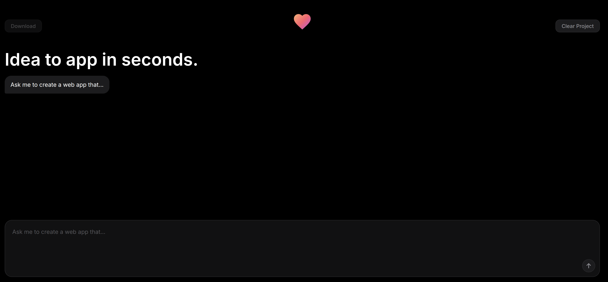
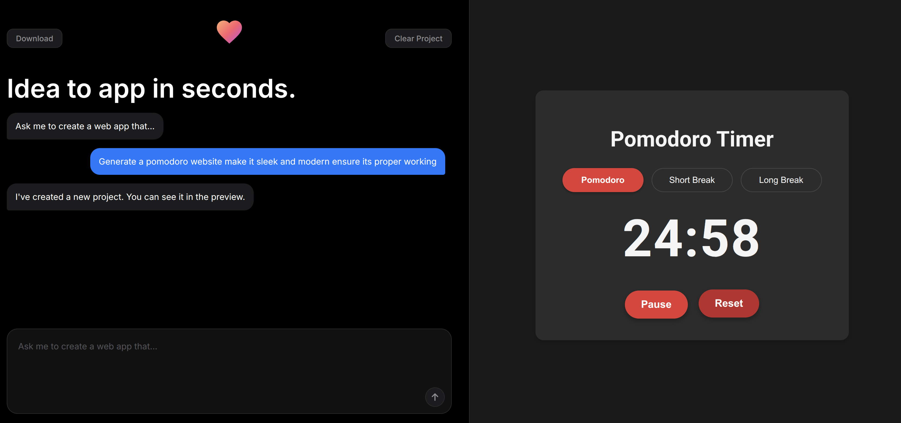

# Website Builder – Local AI-Powered Code Assistant

## Overview
This repository contains a **local website-builder** powered by Large-Language-Models.  You describe the web-site you want in plain English and the agent automatically generates:

* `index.html` – full semantic HTML
* `styles.css` – clean, responsive CSS
* `app.js` – optional JavaScript for interactivity

The backend is written in **FastAPI** and orchestrates:

1. A conversational **LangGraph** agent (`agent.py`) that coordinates generation & editing steps.
2. A **Google Gemini** model (via `llm_client.py`) for code generation.
3. **ChromaDB** vector store (`embeddings.py`) that enables retrieval-augmented-generation (RAG) from previously generated projects.
4. A real-time **watchdog** file-watcher (`file_watcher.py`) that re-indexes any edits you make by hand.

The frontend (in `frontend/`) is a minimal **React + Vite** single-page-app that talks to the backend REST API.

---


## Screenshots

<p align="center">
  
</p>
<p align="center">
  
</p>

---

## Key Features
* **Prompt-to-Website** – describe the desired site and receive HTML/CSS/JS.
* **Smart Web Search** – automatically searches for working image URLs, website cloning info, and design inspiration.
* **Website Cloning** – provide any website URL and it will search and recreate the layout/design.
* **Working Images** – searches for and uses actual loadable image URLs instead of placeholders.
* **Iterative Editing** – keep chatting to refine an existing project; the agent keeps state across turns via SQLite checkpoints.
* **RAG** – the agent can pull context from past code snippets to stay consistent.
* **Embeddings on save** – any manual edits are automatically re-indexed so the AI is aware of them.
* **Downloadable ZIPs** – grab the generated site at any time with the `/api/download/{project}` endpoint.

---

## Project Layout (trimmed)
```
website-builder/
├── agent.py                # LangGraph workflow
├── main.py                 # FastAPI entry-point
├── llm_client.py           # Gemini wrapper
├── embeddings.py           # ChromaDB helpers
├── file_watcher.py         # Watchdog integration
├── generated_apps/         # Output projects (auto-created)
├── chroma_db/              # Persistent vector store
├── models/                 # (Optional) local GGUF weights
└── frontend/               # React SPA (Vite)
```

---

## Quickstart
### 1. Clone & create a virtualenv
```bash
python -m venv venv
source venv/bin/activate
pip install -r requirements.txt
```

### 2. Configure environment variables
Create a `.env` file in the project root:
```env
GOOGLE_API_KEY=your_gemini_key_here
TAVILY_API_KEY=your_tavily_key_here  # For web search (image URLs, website cloning)
```

**Note:** The `TAVILY_API_KEY` is optional but highly recommended for:
- Getting working image URLs that actually load
- Cloning websites when given a URL
- Finding current design trends and examples

### 3. Start the server
```bash
python main.py --host 0.0.0.0 --port 8000
```
Navigate to `http://localhost:8000` to open the UI.

---

## API Reference
| Method | Endpoint | Payload / Params | Description |
|--------|----------|------------------|-------------|
| POST   | `/api/chat` | `{ "message": "Build me a portfolio site" , "session_id": "default"}` | Main chat interface |
| POST   | `/api/clear` | (optional `session_id`) | Reset agent state, DB & generated files |
| GET    | `/api/download/{project_name}` |  | Download ZIP of a generated site |
| GET    | `/generated/{project_name}/{path}` |  | Serve individual generated files |

---

## Web Search Examples

The agent will automatically search the web when you make requests like:

### 🖼️ **Working Images**
- *"Create a portfolio site with high-quality nature photos"*
- *"Add a hero section with professional headshot images"*
- *"Include a gallery of working car images"*

### 🌐 **Website Cloning**
- *"Clone the design of https://stripe.com"*
- *"Make it look like https://github.com"*
- *"Copy the layout from https://tailwindcss.com"*

### 🎨 **Design Inspiration**
- *"Create a modern SaaS landing page"*
- *"Make it look like Apple's website"*
- *"Use current design trends for a restaurant site"*

### 🏢 **Logo Images**
- *"Add the Nike logo to the header"*
- *"Include the company logo for Tesla"*
- *"Find and use the OpenAI logo"*

---

## Development
* **Hot-Reload** – frontend uses Vite; run `npm run dev` inside `frontend/` while the backend runs separately.
* **Persistent State** – LangGraph checkpoints stored in `langgraph_state.sqlite`.
* **Vector Store** – ChromaDB files live in `chroma_db/`.
* **Large Models** – If you want full local inference you can place GGUF weights inside `models/` and wire up an alternative `LLMClient`.

---